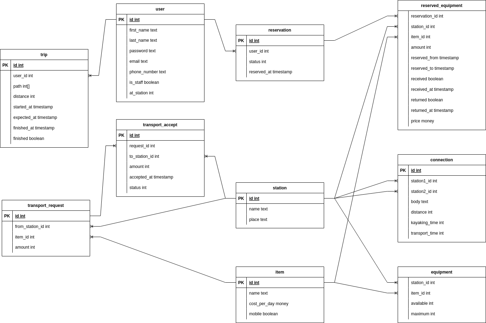
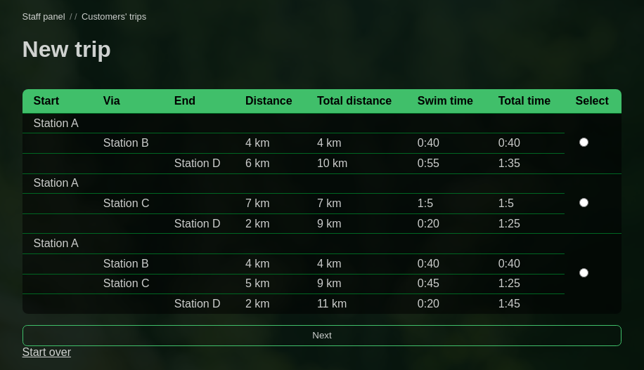
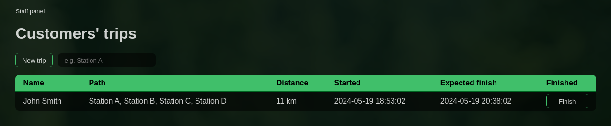
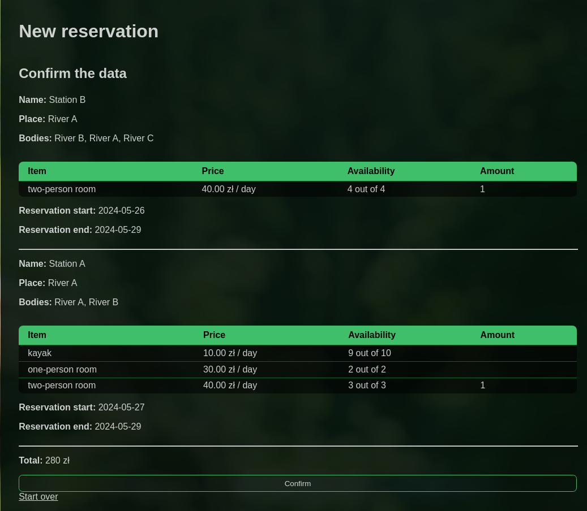
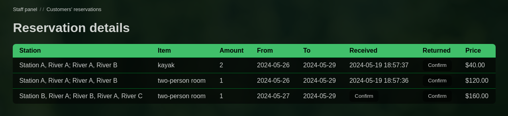

### Purpose

My solution for the following task, received during the database course at my university in 2023:

> Design and write an application that performs the task:\
> "A company has a network of water stations on rivers and lakes, along which there are kayaking routes. Each station has a parking lot, a campsite, and some also offer indoor accommodation (cottages) and kayak rentals. Stations also provide transport for kayaks and people. Design a database with information about the stations and their equipment, as well as the trail network (approximate location of the stations, transport and sailing times). The customer should be able to book equipment and stay. In addition to individual customers, you can also reserve equipment and places for larger groups. Additionally, the database records the customer's departure on the trail to check whether they reach the planned destination on time."

Its focus was on designing the database and creating appropriate triggers for it.

### Highlights

- Fully manually-written with PHP, pure CSS, PostgreSQL.
- A recursive SQL query for finding a path between two nodes in a graph (https://github.com/Acors24/uwr-db-project/blob/f056a02790942614e5df7bec03c4a943ab63bfdd/server/html/new_trip.php#L74-L81)

### Database diagram



### Installation

Create the database:

```
createdb -U postgres db_project --owner=USERNAME
```

Import `schema.sql`:
```
psql -d db_project < schema.sql
```

Tables `item`, `station`, `connection` and `equipment` need to be filled manually.\
Setting users as staff (higher privileges) also is done manually by setting `is_staff` to `true` and appropriately setting their `at_station`.

The following should be enough for the app to work:
```
cd server/html
php -S localhost:3000
```
Tested with:
- `PHP 8.3.7 (cli) (built: May  7 2024 16:35:26) (NTS gcc x86_64)`
- `psql (PostgreSQL) 16.1`


### Screenshots presenting a few functionalities








